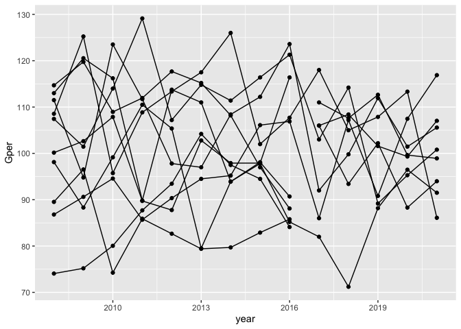

<!-- README.md is generated from README.Rmd. Please edit that file -->

# Season-end Percentage (Walkthrough)

This document steps through the code to produce the figure in
[README.md](./README.md). The output (.md/.html files) can be generated
from the input (.Rmd files) using the following commands:

``` r
rmarkdown::render('./walkthrough.Rmd')
rmarkdown::render('./README.Rmd')
```

The first thing we need are some libraries to munge the data and create
the graphic:

``` r
## tidyverse brings in a bunch of useful packages
## here provides easy to use relative paths (to the .git folder)
## magick allows us to read in png
## install.packages('tidyverse'); install.packages('here')
## install.packages('magick')
library(tidyverse)
library(here)
library(magick)
```

OK. Let’s read in the data that Aaron’s provided and take a quick look
at it:

``` r
time_machine <- read_csv(here('datasets/vol1/resultsFromTheTimeMachine.csv'))
#> 
#> ── Column specification ────────────────────────────────────────────────────────────────
#> cols(
#>   team = col_character(),
#>   played = col_double(),
#>   win = col_double(),
#>   draw = col_double(),
#>   loss = col_double(),
#>   GF = col_double(),
#>   GA = col_double(),
#>   Gdiff = col_double(),
#>   Gper = col_double(),
#>   pts = col_double(),
#>   bonusPts = col_double(),
#>   finalsWin = col_double(),
#>   finalsLoss = col_double(),
#>   year = col_double(),
#>   coach = col_character(),
#>   minorPremiership = col_character(),
#>   premiership = col_character(),
#>   runnerUp = col_character(),
#>   competition = col_character()
#> )
glimpse(time_machine)
#> Rows: 130
#> Columns: 19
#> $ team             <chr> "Magic", "Swifts", "Thunderbirds", "Vixens", "Firebir…
#> $ played           <dbl> 13, 13, 13, 13, 13, 13, 13, 13, 13, 13, 13, 13, 13, 1…
#> $ win              <dbl> 10, 10, 9, 9, 7, 7, 5, 5, 2, 0, 12, 11, 10, 8, 8, 5, …
#> $ draw             <dbl> 0, 0, 0, 0, 0, 0, 0, 0, 1, 1, 0, 0, 0, 0, 0, 0, 0, 0,…
#> $ loss             <dbl> 3, 3, 4, 4, 6, 6, 8, 8, 10, 12, 1, 2, 3, 5, 5, 8, 8, …
#> $ GF               <dbl> 687, 727, 652, 673, 693, 617, 625, 607, 605, 471, 769…
#> $ GA               <dbl> 599, 652, 577, 620, 645, 616, 637, 678, 697, 636, 614…
#> $ Gdiff            <dbl> 88, 75, 75, 53, 48, 1, -12, -71, -92, -165, 155, 111,…
#> $ Gper             <dbl> 114.69, 111.50, 113.00, 108.55, 107.44, 100.16, 98.12…
#> $ pts              <dbl> 20, 20, 18, 18, 14, 14, 10, 10, 5, 1, 24, 22, 20, 16,…
#> $ bonusPts         <dbl> NA, NA, NA, NA, NA, NA, NA, NA, NA, NA, NA, NA, NA, N…
#> $ finalsWin        <dbl> 1, 2, 1, NA, NA, NA, NA, NA, NA, NA, 2, NA, 2, 1, NA,…
#> $ finalsLoss       <dbl> 2, NA, 1, 1, NA, NA, NA, NA, NA, NA, NA, 2, 1, NA, NA…
#> $ year             <dbl> 2008, 2008, 2008, 2008, 2008, 2008, 2008, 2008, 2008,…
#> $ coach            <chr> "Noeline Taurua", "Julie Fitzgerald", "Jane Woodlands…
#> $ minorPremiership <chr> "Yes", "No", "No", "No", "No", "No", "No", "No", "No"…
#> $ premiership      <chr> "No", "Yes", "No", "No", "No", "No", "No", "No", "No"…
#> $ runnerUp         <chr> "Yes", "No", "No", "No", "No", "No", "No", "No", "No"…
#> $ competition      <chr> "ANZC", "ANZC", "ANZC", "ANZC", "ANZC", "ANZC", "ANZC…
```

Looks like it’s already ‘tidy’, so we should be able to get a very
simple version of a graphic straight up. I’m going to look at season-end
percentage, over time, so I’ll first ensure everything’s in the order I
want. Here’s the resulting simple figure:

``` r
time_machine <- time_machine %>%
  arrange(team, year)
time_machine %>%
  ggplot(aes(x = year, y = Gper, group = team)) +
  geom_point() +
  geom_path()
```

<!-- -->

I don’t like the points, so we’ll get rid of those. I’m also going to
pull out a couple of teams to highlight, keeping the rest of the teams
in the ‘background’ by colouring them a light grey. We’ll get rid of the
background as well, maybe some other things after seeing what it looks
like!

``` r
## set up a colour vector
time_machine <- time_machine %>%
  mutate(
    colour = case_when(
      team == 'Fever' ~ '#05AE5F',
      team == 'Vixens' ~ '#DF005A',
      TRUE ~ 'lightgrey'
    )
  )
time_machine %>%
  ggplot(aes(x = year, y = Gper, group = team, colour = colour)) +
  geom_path() +
  scale_colour_identity() +
  theme_minimal()
```

<!-- -->

That’s not too bad, but let’s add a little more bling. Aaron’s added
some logos, so we’ll add those to call out the teams. We’ll remove
gridlines, they’re not pleasant; add some nicer labelling, and also add
a marker splitting the figure into ANZC vs SSN.

First, we’ll read in the logos:

``` r
vixens <- image_read(here('examples/vol1/images/Vixens_small.png')) %>%
  as.raster()
fever <- image_read(here('examples/vol1/images/Fever_small.png')) %>%
  as.raster()
```

Now we’ll apply the logos at the appropriate positions, remove gridlines
and add in the nicer labelling/markers:

``` r
bling_it <- time_machine %>%
  ggplot(aes(x = year, y = Gper, group = team, colour = colour)) +
  geom_path() +
  scale_colour_identity() +
  theme_classic() +
  geom_vline(
    xintercept = 2016.5, colour = 'darkgreen', alpha = 0.5,
    lty = 3
  ) +
  labs(
    x = '', y = 'Percentage',
    caption =
  str_wrap('End of season percentage for all ANZC and SSN teams. To the left of the dotted line are season end percentages in the ANZC, to the right, SSN.',
  100)
  ) +
  annotation_raster(vixens, 2020.5, 2021.5, 83, 88) +
  annotation_raster(fever, 2020.5, 2021.5, 117, 122)
bling_it
```

<!-- -->

Now we can save it (by default, `ggsave` saves the last image, and the
aspect ratio is the golden ratio):

``` r
ggsave(
  here('examples/vol1-sl/fig.png'),
  width = 9, height = 18 / (1 + sqrt(5)), dpi = 'retina'
)
```
