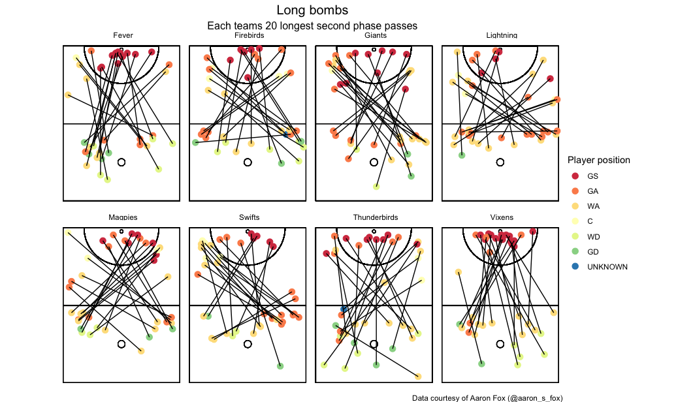
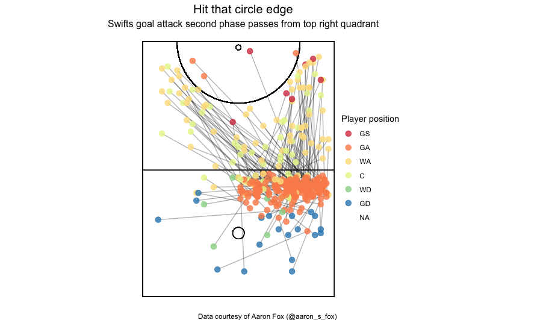
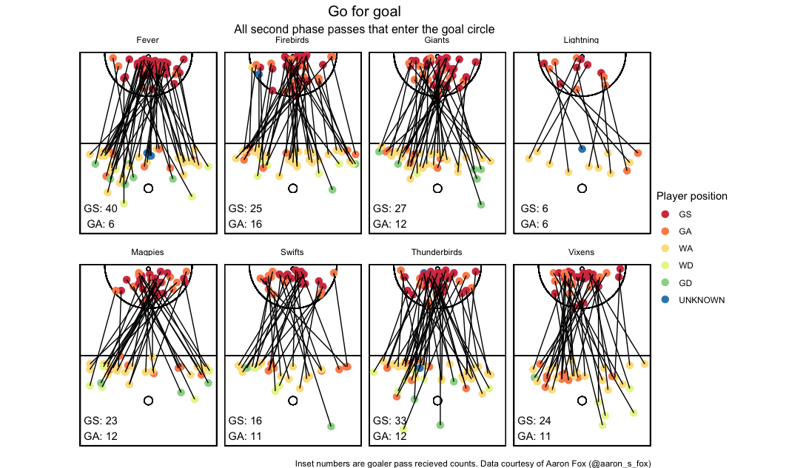

<!-- README.md is generated from README.Rmd. Please edit that file -->

# Ask and you shall receive

This was a really interesting and rich data set. I’ve put together some
of the ideas that came quickly and saved one of the more interesting
things I found (but not that interesting) for a longer form.

## Long bombs

First up is the teams 20 longest second phase passes. Unsurprisingly
lots of the long passes are cross passes from the transverse line. I
found the preference of some teams to go right to left interesting
(Giants and Swifts), and the Vixens going to goal (almost exclusively)
when going long. To me, this seems like a risky pass, I would imagine
there’s a lot of hands between one side of the transverse line to the
opposite circle edge, especially less than 6 seconds after the centre
pass. For those people who are netball inclined, I’d love an
explanation. My guess is that the 10-20 instances shown here are the
result of a very unique/uncommon player setup. For reference, this data
set contains 600-700 records for the first two passes, per team.

Another interesting behaviour is the Lightning’s long passes are
probably, on average, the closest to the transverse line, and the least
likely to go into the circle. Magpies buck the right to left trend.
Fever go from left side to right on goal often.

## Hitting the circle edge

The Swift’s passing behaviour stuck out a bit to me, so I looked a bit
closer at one play type. Lots of their passes go to the GA in the upper
right hand corner of the centre third (isolated here). The following
passes tended to head in one of two directions and to the circle edge,
but not often straight to the circle. To me, the direction of the passes
is down to the opposing defender, with very few passes heading directly
at the ring.

## Early Passes to the goal circle

Finally I looked at second phase passes that went into the goal circle.
Plenty of variation here. The Lightning clearly did it the least. Fever
went to their GS on the second phase a lot Thinking face. Teams actually
had a similar average distance from the end line (y-coordinate).

This is a relatively superficial look at this data, and some of the
conclusions I’ve made could be explained by other factors (maybe those
passes straight at goal end up being turnovers?). I found this data
really interesting, which has so many areas that could be explored to
try and understand how teams operate in these early phases after a
restart.
