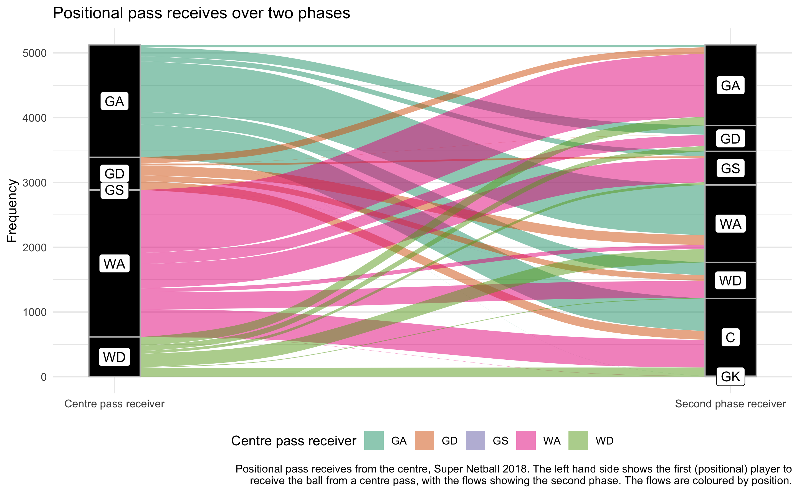

<!-- README.md is generated from README.Rmd. Please edit that file -->

# Ask and you shall receive

<!-- badges: start -->
<!-- badges: end -->

# Summary

In the second volume of \#NetballNumbers I’m interested in who receives
the ball through the two phases, *positionally*. So for this challenge,
I ignored the team, looking purely at who received the ball from the
centre pass in the 2018 Super Netball season.

I think the figure works for what I wanted: you can see that the WA and
GA receive most of the ball from the centre. This is no surprise, most
teams will want to attack. Also, if the GA receives the centre pass,
they look to the WA or C on the second phase—again, this seems pretty
reasonable, that first centre pass to the WA will be setting up a play,
with the WA passing the ball off in anticipation to run a decoy for the
GS, or receive the ball themselves to shoot for goal.

If you want to see how I’ve done this, see [the
walkthrough](walkthrough.md).
