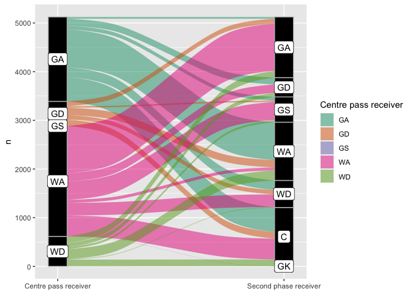
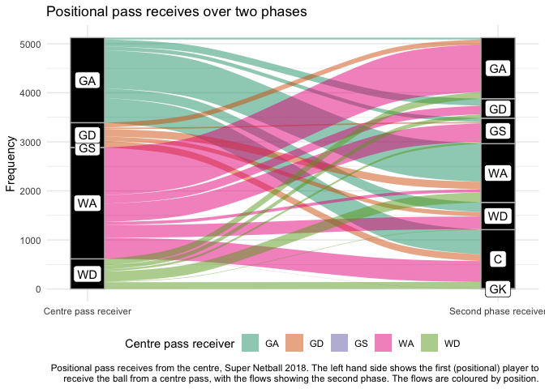

<!-- README.md is generated from README.Rmd. Please edit that file -->

# Ask and you shall receive (Walkthrough)

This document steps through the code to produce the figure in
[README.md](./README.md). The output (.md/.html files) can be generated
from the input (.Rmd files) using the following commands:

``` r
rmarkdown::render('./walkthrough.Rmd')
rmarkdown::render('./README.Rmd')
```

The first thing we need are some libraries to munge the data and create
the graphic:

``` r
## tidyverse brings in a bunch of useful packages
## here provides easy to use relative paths (to the .git folder)
## magick allows us to read in png
## ggalluvial allows sankey plots
## install.packages('tidyverse'); install.packages('here')
## install.packages('magick'); install.packages('ggalluvial)
library(tidyverse)
#> ── Attaching packages ─────────────────────────────────────────────── tidyverse 1.3.1 ──
#> ✔ ggplot2 3.3.3     ✔ purrr   0.3.4
#> ✔ tibble  3.1.1     ✔ dplyr   1.0.5
#> ✔ tidyr   1.1.3     ✔ stringr 1.4.0
#> ✔ readr   1.4.0     ✔ forcats 0.5.1
#> ── Conflicts ────────────────────────────────────────────────── tidyverse_conflicts() ──
#> ✖ dplyr::filter() masks stats::filter()
#> ✖ dplyr::lag()    masks stats::lag()
library(here)
#> here() starts at /Users/sprazza/github/netball-numbers-challenge
library(ggalluvial)
```

OK. Let’s read in the data that Aaron’s provided and take a quick look
at it:

``` r
ask_receive <- read_csv(here('datasets/vol2/askAndYouShallReceive.csv'))
#> 
#> ── Column specification ────────────────────────────────────────────────────────────────
#> cols(
#>   roundNo = col_double(),
#>   matchNo = col_double(),
#>   quarterNo = col_double(),
#>   teamName = col_character(),
#>   centrePassRec = col_character(),
#>   centrePassX = col_double(),
#>   centrePassY = col_double(),
#>   secondPhaseRec = col_character(),
#>   secondPhaseX = col_double(),
#>   secondPhaseY = col_double()
#> )
glimpse(ask_receive)
#> Rows: 6,086
#> Columns: 10
#> $ roundNo        <dbl> 1, 1, 1, 1, 1, 1, 1, 1, 1, 1, 1, 1, 1, 1, 1, 1, 1, 1, 1…
#> $ matchNo        <dbl> 1, 1, 1, 1, 1, 1, 1, 1, 1, 1, 1, 1, 1, 1, 1, 1, 1, 1, 1…
#> $ quarterNo      <dbl> 1, 1, 1, 1, 1, 1, 1, 1, 1, 1, 1, 1, 1, 1, 1, 1, 1, 2, 2…
#> $ teamName       <chr> "Thunderbirds", "Thunderbirds", "Thunderbirds", "Thunde…
#> $ centrePassRec  <chr> "WA", "WD", "GD", "GA", "WA", "GD", "GA", "GA", "GA", "…
#> $ centrePassX    <dbl> 25, 79, 31, 93, 26, 24, 23, 69, 40, 90, 48, 86, 52, 94,…
#> $ centrePassY    <dbl> 131, 77, 118, 130, 125, 111, 130, 131, 121, 109, 131, 1…
#> $ secondPhaseRec <chr> "GA", "GD", "GA", NA, "GS", "WA", "WA", NA, "GD", "WA",…
#> $ secondPhaseX   <dbl> 11, 18, 28, NA, 48, 19, 17, NA, 42, 71, 53, 32, 71, 57,…
#> $ secondPhaseY   <dbl> 193, 90, 171, NA, 190, 140, 182, NA, 95, 147, 139, 162,…
```

Looks like it’s already ‘tidy’, so we should be able to get a very
simple version of a graphic straight up. I’m going to look at the flow
from C to centre pass receive and then on to the second phase. Nothing
tricky, averaged over the whole season and teams at the moment. We’ll
remove the unknowns and then count the passes:

``` r
ask_receive_counts <- ask_receive %>%
  filter(centrePassRec != 'UNKNOWN', secondPhaseRec != 'UNKNOWN') %>%
  mutate(Centre = 'C') %>%
  rename(
    'Centre pass receiver' = centrePassRec,
    'Second phase receiver' = secondPhaseRec
  ) %>%
  count(Centre, `Centre pass receiver`, `Second phase receiver`)
ask_receive_counts
#> # A tibble: 28 x 4
#>    Centre `Centre pass receiver` `Second phase receiver`     n
#>    <chr>  <chr>                  <chr>                   <int>
#>  1 C      GA                     C                         503
#>  2 C      GA                     GA                         37
#>  3 C      GA                     GD                        141
#>  4 C      GA                     GK                          1
#>  5 C      GA                     GS                         77
#>  6 C      GA                     WA                        777
#>  7 C      GA                     WD                        198
#>  8 C      GD                     C                         137
#>  9 C      GD                     GA                         99
#> 10 C      GD                     GD                          2
#> # … with 18 more rows
```

OK, let’s do a simple Sankey plot—i.e. how the passes flow
*positionally* over two phases:

``` r
pl_receive <- ask_receive_counts %>%
  ggplot(
    aes(
      y = n, axis1 = `Centre pass receiver`,
      axis2 = `Second phase receiver`
    )
  ) +
  geom_alluvium(aes(fill = `Centre pass receiver`), width = 1/12) +
  geom_stratum(width = 1/12, fill = "black", color = "grey") +
  geom_label(stat = "stratum", aes(label = after_stat(stratum))) +
  scale_x_discrete(
    limits = c("Centre pass receiver", "Second phase receiver"),
    expand = c(.05, .05)
  ) +
  scale_fill_brewer(type = "qual", palette = "Dark2")
pl_receive
#> Warning in to_lodes_form(data = data, axes = axis_ind, discern =
#> params$discern): Some strata appear at multiple axes.

#> Warning in to_lodes_form(data = data, axes = axis_ind, discern =
#> params$discern): Some strata appear at multiple axes.

#> Warning in to_lodes_form(data = data, axes = axis_ind, discern =
#> params$discern): Some strata appear at multiple axes.
```

<!-- -->

That’s not too bad, but I think I want to remove the grey background,
and probably put the legend at the bottom. Also, add a nicer title and
legend description:

``` r
pl_receive_nicer <- pl_receive +
  theme_minimal() +
  theme(legend.position = 'bottom') +
  labs(
    y = 'Frequency',
    title = 'Positional pass receives over two phases',
    caption = str_wrap(
      'Positional pass receives from the centre, Super Netball 2018. The left hand side shows the first (positional) player to receive the ball from a centre pass, with the flows showing the second phase. The flows are coloured by position.',
      width = 120
    )
  )
pl_receive_nicer
#> Warning in to_lodes_form(data = data, axes = axis_ind, discern =
#> params$discern): Some strata appear at multiple axes.

#> Warning in to_lodes_form(data = data, axes = axis_ind, discern =
#> params$discern): Some strata appear at multiple axes.

#> Warning in to_lodes_form(data = data, axes = axis_ind, discern =
#> params$discern): Some strata appear at multiple axes.
```

<!-- -->

Now we can save it (by default, `ggsave` saves the last image, and the
aspect ratio is the golden ratio):

``` r
ggsave(
  here('contributions/vol2/SteveLane/asking.png'),
  width = 9, height = 18 / (1 + sqrt(5)), dpi = 'retina'
)
#> Warning in to_lodes_form(data = data, axes = axis_ind, discern =
#> params$discern): Some strata appear at multiple axes.

#> Warning in to_lodes_form(data = data, axes = axis_ind, discern =
#> params$discern): Some strata appear at multiple axes.

#> Warning in to_lodes_form(data = data, axes = axis_ind, discern =
#> params$discern): Some strata appear at multiple axes.
```
