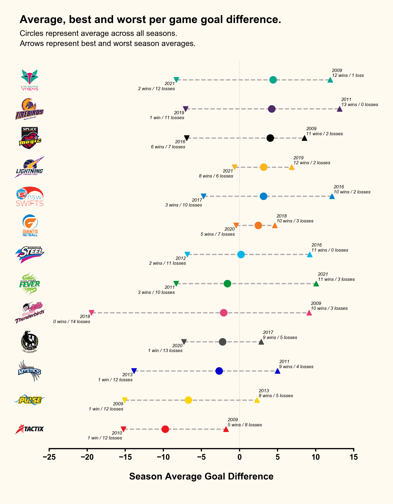

  
  <em>Click me for high resolution version...</em>

### Summary

I decided to focus on goal difference in creating a visual for this dataset — specifically, the average goal difference for each team across seasons. This didn't require much data manipulation, simply dividing the total season goal difference by the number of games played. From this I was then able to calculate the average for each team across all seasons played (illustrated via the circular points on the figure), and also extract their 'best' and 'worst' performing season for average goal difference (illustrated via the up and down arrows, respectively). I then referred back to the original dataset in annotating these 'best' and 'worst' performances with the year and win/loss record of the season added.

This figure uses the team logos to give a more visual feel in communicating the axes labels. These are available in the [images folder](images) of this example — so feel free to use them in your own work. I also removed the axes spines for the majority of borders, as I feel this gives a much cleaner look in an instance like this. Lastly a 'light' background colour is used to soften up the image — this doesn't really work when placing a figure within a document, but I find is useful when presenting figures online via social channels.

### Code

The `vol1_example.py` script in this folder contains the code used to generate this figure. I ran this using Python v3.7.6, taking advantage of the `pandas` library for the data management and the `matplotlib` library for the data visualisation. 