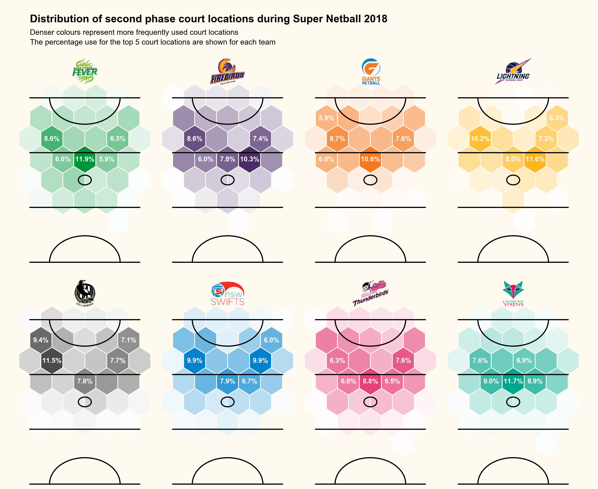

### Summary

My approach with this dataset was to use the geographical court location (i.e. XY coordinates) for second phase across each team to highlight common locations and investigate whether any obvious differences were present. This required pretty much no data manipulation, but required some tweaking and decisions to get the best looking visual. This included creating the colour palette shades for each team, figuring out the best shape and size for the 'bins' (hex shape ended up with the win), and designing a 'minimalist' style court outline to sit underneath the data. The top 5 most common locations and the percentage of second phase receptions in these bins for each team are displayed on the graph to show some numerical data.

  

Like the volume 1 example, this figure again uses the team logos to give a more visual feel for the plot titles. These are available in the [images folder](images) of this example — so feel free to use them in your own work. I think the 'minimalist' court design used in this figure just cleans it up a little and makes it less cluttered. I used the 'light' background colour again to to soften up the image, but this also provides a good contrast to the team colours used.

### Code

The `vol2_example.py` script in this folder contains the code used to generate this figure. I ran this using Python v3.7.6, taking advantage of the `pandas` library for the data management and the `matplotlib` library for the data visualisation. 