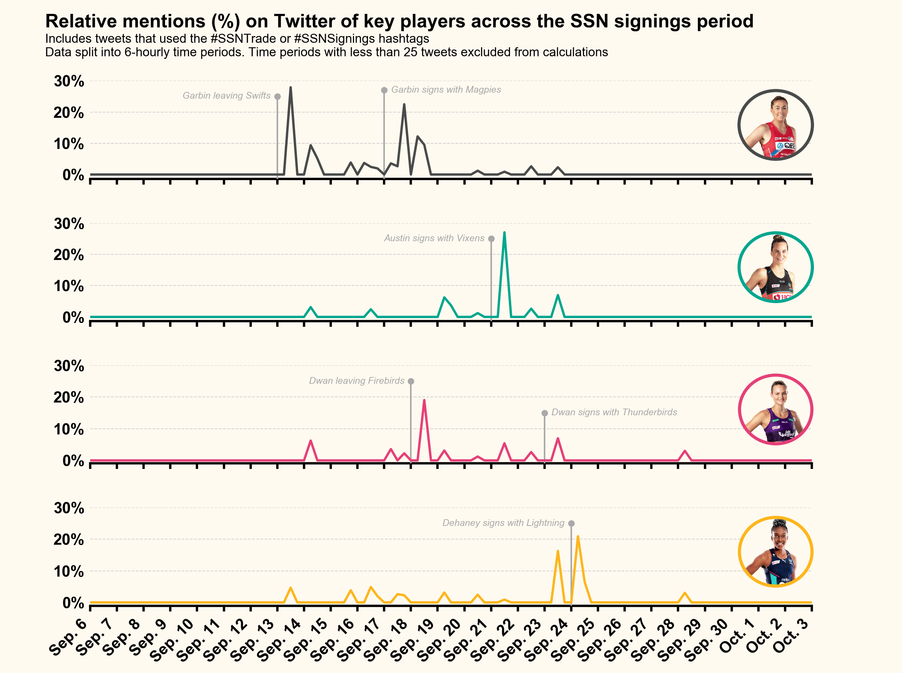

### Summary

My approach with this dataset was to examine how often players were being mentioned in tweets from the SSN signings period. To do this, I split the tweets into 6-hourly blocks and searched from a list of players names for mentions across these tweets. To ensure it was relative, I also took the total number of tweets from the 6-hour block. I decided to plot the mention trajectories of four players that swapped teams over the period, as each of these appeared to have relative spikes at certain times over the period that aligned with either their announcement to leave or signing with a new team. 

  

Like previous volume examples, I've used imagery to communicate what the data is showing - in this case the player that each axis relates to. These images were simply obtained from old squad lists from each teams website (from 2020 I think) and a circular mask applied (in Illustrator) to get the circular effect. I've also used specific annotations on each axis to indicate key pieces of news relating to the players that correspond to the spikes in Twitter mentions.

### Code

The `vol3_example.py` script in this folder contains the code used to generate this figure. I ran this using Python v3.7.6, taking advantage of the `pandas` library for the data management (with particular reference to the Timestamp class in this case) and the `matplotlib` library for the data visualisation. 