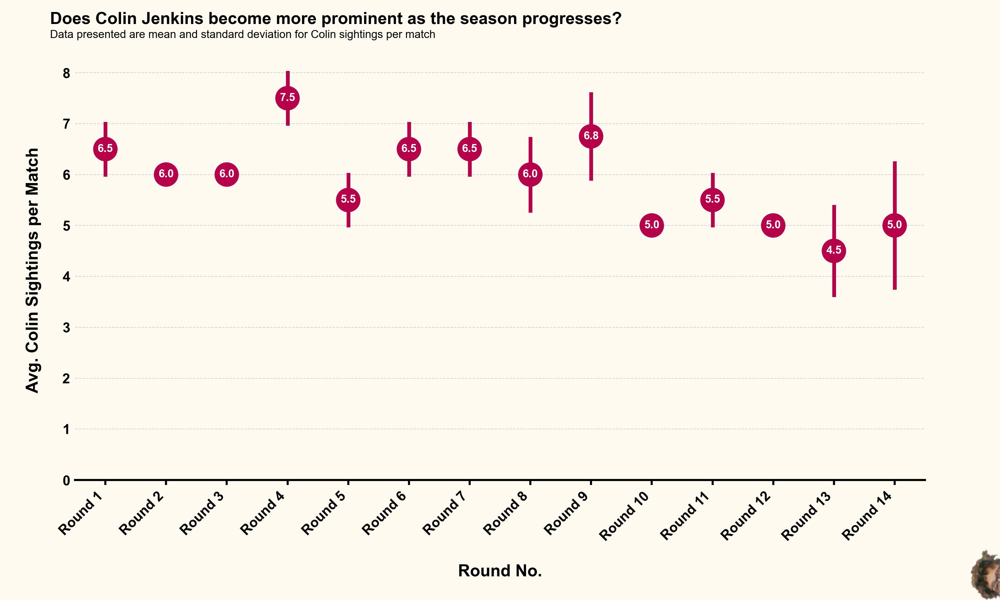

### Summary

The approach with this dataset was not to go overly complex, and look at the average Colin 'sightings' across each round. The way the data were organised and the usefulness of the `seaborn` point plot function meant the data could be directly plugged in to the function and do most of the work. After this it was just about editing the plot parameters (e.g. changing labels, colours, adding text) and adding a sneaky image.

  

### Code

The `vol4_example.py` script in this folder contains the code used to generate this figure. I ran this using Python v3.9.5, taking advantage of the `pandas` library for the data management and the `seaborn` and `matplotlib` libraries for the data visualisation. 