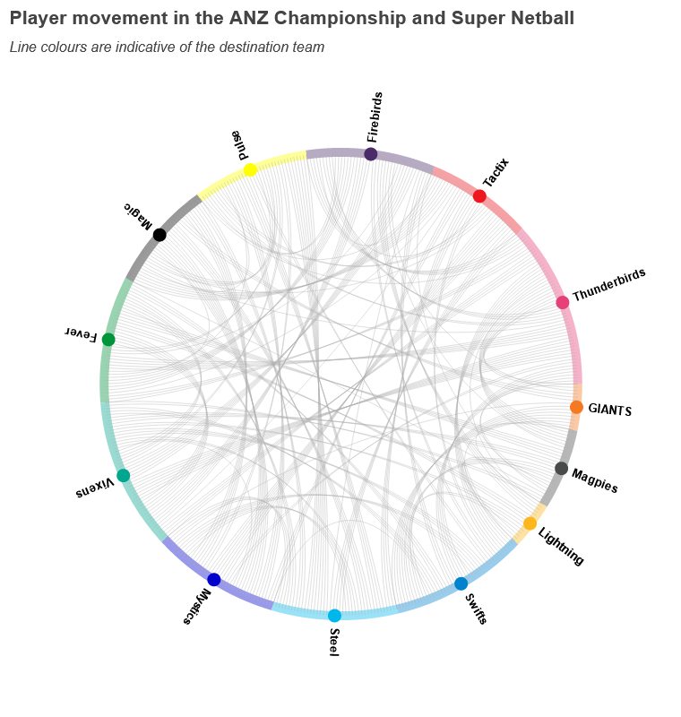
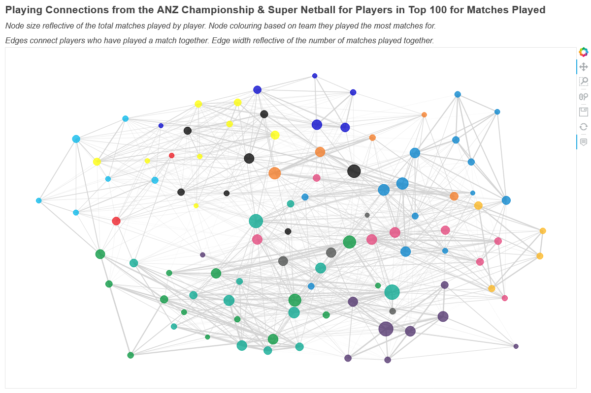

### Summary

My approach with this dataset was to examine the connections between both teams and players across the ANZ Championship and Super Netball competitions. My main motivation for both of these topics was to test out some new interactive graphs — namely a chord plot and network graph.

#### Team-to-Team Connections

In examining team-to-team connections I combed through the dataset and looked at instances where players had moved from one team to another, and tallied up how often this occurred between each combination of ANZC and SSN teams. 

  

The real magic of the above plot is being able to use the interactive features, which you can access [here](https://aaronsfox.github.io/super-netball-outputs/vol6_example_1.html). By hovering over or clicking on each of the team nodes around the edge of the plot — you will be able to see the number of players that have transferred to and from this team.

#### Player Connections

To examine player connections I extracted the players in the top 100 for matches played in the ANZ and SSN, and looked at the number of times each player had played with the other players in the group. From these data I created the below network graph that connects the players as nodes (i.e. the circles) to the others they have played with via edges (i.e. the lines). In the below network graph, the size of the nodes is reflective of the total number of matches played by the player, and the thickness of the edges is reflective of the number of matches they have played with the connected node.

  

Once again, the best aspect of this graph is the interactivity — which you can experience [here](https://aaronsfox.github.io/super-netball-outputs/vol6_example_2.html). By hovering or clicking on the nodes — you can identify who the player is, and their connections to other players will also be highlighted. I found it interesting to see how certain players had a significant reach through connections to other players in this group.

### Code

The `vol6_example.py` script in this folder contains the code used to generate both of the figures. I ran this using Python v3.9.5, taking advantage of the `pandas` library for the data management and the `holoviews` and `bokeh` libraries for the interactive visualisations. 