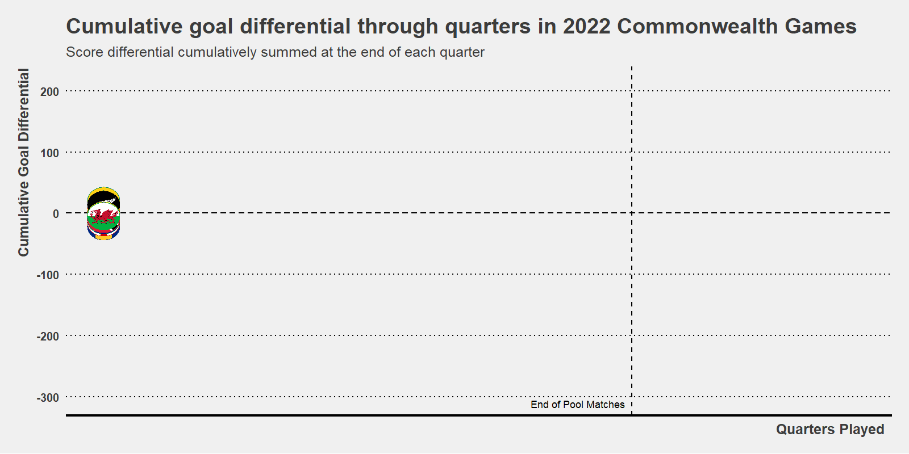

### Summary

My approach with this dataset was to visualise and animate the cumulative goal differential for each team across the tournament. A motivation for doing this was to have a go at the `{gganimate}` package in R. In an attempt to clean up the plot I used the flag images and colourings to avoid the need to crowd the plot area with a legend.

  

### Code

The `vol8_example.py` script in this folder contains the code used to generate both of the figures. I ran this using R, taking advantage predominantly of the `{ggplot}`, `{gganimate}`, `{ggthemes}` and `{geom_image}` libraries for creating and animating the plot. 